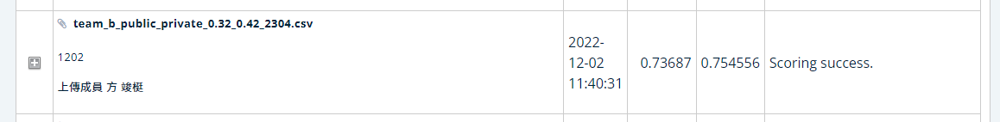

**:hear_no_evil:AICUP2022_無人機飛行載具之智慧計數競賽:hear_no_evil:**
=
[無人機飛行載具之智慧計數競賽](https://tbrain.trendmicro.com.tw/Competitions/Details/25)
-

**指導教授:劉宗榮**

**隊伍名稱:Team_2059**

**隊長:陳語嫣，組員:方峻梃、廖浩翔、謝東格、張祐嘉**

**Paper - [YOLOv7: Trainable bag-of-freebies sets new state-of-the-art for real-time object detectors](https://arxiv.org/abs/2207.02696)**


**整體流程**
-

```
Training
├── runs
│   ├── train               存放訓練權重資料夾
│   ├── detect              存放 public 跟 private 輸出資料夾 
│   └── save                存放 public 跟 private .csv 輸出資料夾 
│
├── make_txt.py             把主辦單位給的csv轉成相關格式
├── Target data set
│   ├── train.txt           轉檔後的訓練標籤檔
│   ├── val.txt             轉檔後的驗證標籤檔 
│   ├── train               存放 train 的 image 跟 labels 資料夾
│   └── save                存放 val 的 image 跟 labels 資料夾
├── train.py                執行訓練及其他參數調整
├── runs
│   ├── train               存放訓練權重資料夾
│   ├── detect              存放 public跟private 的輸出 
│   └── save                存放 public跟private .csv 的輸出 
├── data_arg
│   ├── Ensemble            不同模型跟csv結合
│   ├── Augmentation        資料擴增、翻轉、旋轉     
│   
├── log                     訓練loss可視化(tensorboard)
├── wandb                   訓練loss可視化(wandb)
├── yolov7.pt               YOLOv7 預訓練模型
├── yolov7_w6.pt            YOLOv7_w6 預訓練模型  

Testing
├── detect.py               輸出 public 跟 private 資料集
├── csv_output.py           將 public 跟 private 資料集結果轉為.csv  

```


**Installation Environment**
-
   ```
   作業系統: Windows10(x64)
   語言: Python (Pytorch) 
   函式庫: numpy、torch、tensorboardX、scilit_image、matplotlib、tqdm、easydict、Pillow、slimage、opencv_python、pycocotools
   預訓練模型: YOLOv7 pretrained weights (yolov7.pt)  /  YOLOv7w6 pretrained weights (yolov7w6.pt)

    # create the docker container, you can change the share memory size if you have more.
      nvidia-docker run --name yolov7 -it -v your_coco_path/:/coco/ -v your_code_path/:/yolov7 --shm-size=64g nvcr.io/nvidia/pytorch:21.08-py3

    # apt install required packages
      apt update
      apt install -y zip htop screen libgl1-mesa-glx

    # pip install required packages
      pip install seaborn thop

    # go to code folder
      cd /yolov7

  
 ```


**Training**
-
1. 準備Ground truth label (train.txt跟val.txt)並將訓練圖片放入training資料夾，格式如下
   ```
    D:/Aicup/aicuptrain/images/img10001.jpg
    D:/Aicup/aicuptrain/images/img10002.jpg
    D:/Aicup/aicuptrain/images/img10003.jpg
    D:/Aicup/aicuptrain/images/img10004.jpg
    ...
   ```


2.相關參數

   
    img_size:2048x2048
    learning rate:0.01
    Training Set: 26500
    Validation Set: 8500
    Testing Set: 1000
    Class: 4
    batch_size: 3
    epochs: 80

 
 

 
 
 

 
**最高分數**
-

  


## Rerfence
-
 [YOLOv7: Trainable bag-of-freebies sets new state-of-the-art for real-time object detectors](https://arxiv.org/abs/2207.02696) 
 
  [最新的物件偵測王者 YOLOv7 介紹](https://aiacademy.tw/yolov7/)
  
  [深入淺出Yolo 系列之Yolov7 基礎網絡結構詳解](https://zhuanlan.zhihu.com/p/543743278)
  
  [目標檢測算法——YOLOv7訓練自己的數據集](https://blog.csdn.net/m0_53578855/article/details/127536604)
               
  [機器學習: 集群分析 K-means Clustering](https://chih-sheng-huang821.medium.com/%E6%A9%9F%E5%99%A8%E5%AD%B8%E7%BF%92-%E9%9B%86%E7%BE%A4%E5%88%86%E6%9E%90-k-means-clustering-e608a7fe1b43)
